РОССИЙСКИЙ УНИВЕРСИТЕТ ДРУЖБЫ НАРОДОВ

ФАКУЛЬТЕТ ФИЗИКО-МАТЕМАТИЧЕСКИХ И ЕСТЕСТВЕННЫХ НАУК

КАФЕДРА ИНФОРМАЦИОННЫХ ТЕХНОЛОГИИ

**ОТЧЕТ**

По дисциплине: Информационная безопасность.

Лабораторная работа № 4.

Дискреционное разграничение прав в Linux. Расширенные атрибуты.

Нгуен Чау Ки Ань

1032185287

НБИбд-01-18

1. **Цель работы** 
# Получение практических навыков работы в консоли с расширенными
# атрибутами файлов.
1. # .**Порядок выполнения работы**

\1. От имени пользователя guest определила расширенные атрибуты файла

/home/guest/dir1/file1 командой lsattr /home/guest/dir1/file1

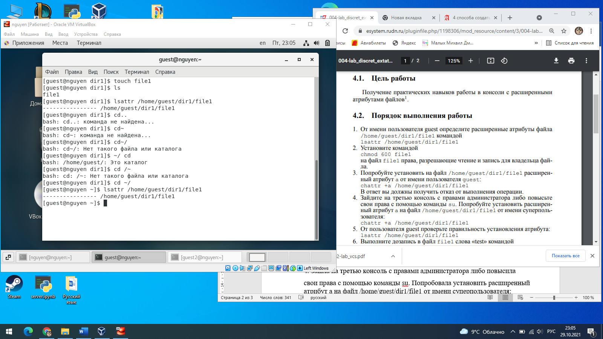

\2. Установила командой chmod 600 file1

на файл file1 права, разрешающие чтение и запись для владельца файла.

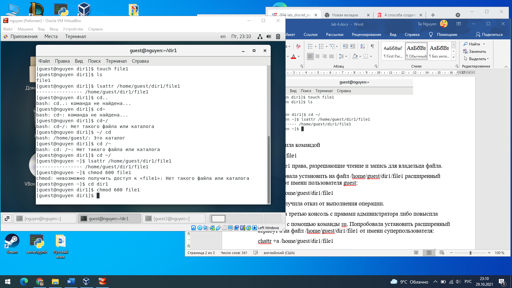

\3. Попробовала установить на файл /home/guest/dir1/file1 расширенный атрибут a от имени пользователя guest:

chattr +a /home/guest/dir1/file1

В ответ получила отказ от выполнения операции.

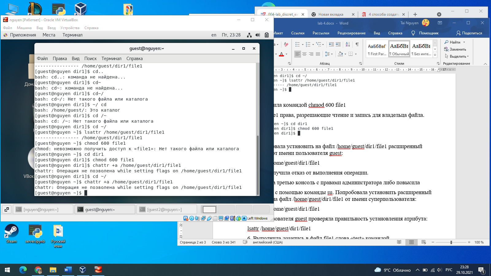

\4. Зашла на третью консоль с правами администратора, повысила

свои права с помощью команды su. Попробовала установить расширенный атрибут a на файл /home/guest/dir1/file1 от имени суперпользователя:

chattr +a /home/guest/dir1/file1

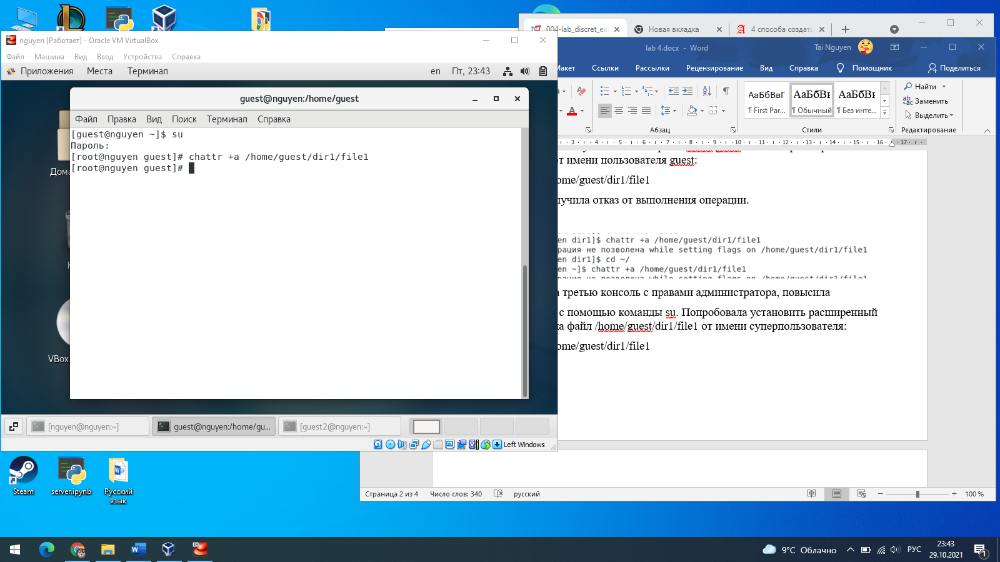

\5. От пользователя guest проверяла правильность установления атрибута:

lsattr /home/guest/dir1/file1

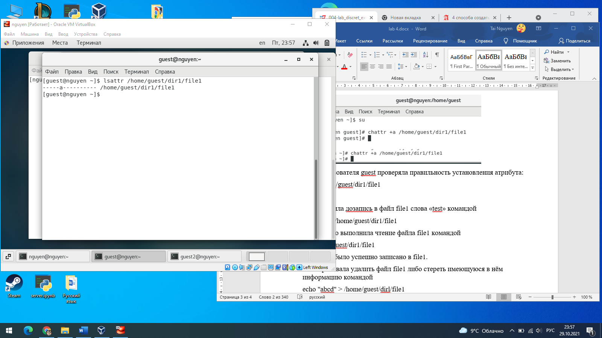

\6. Выполнила дозапись в файл file1 слова «test» командой

echo "test" /home/guest/dir1/file1

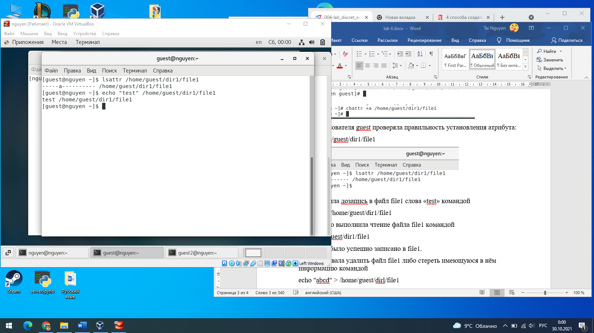

После этого выполнила чтение файла file1 командой

cat /home/guest/dir1/file1

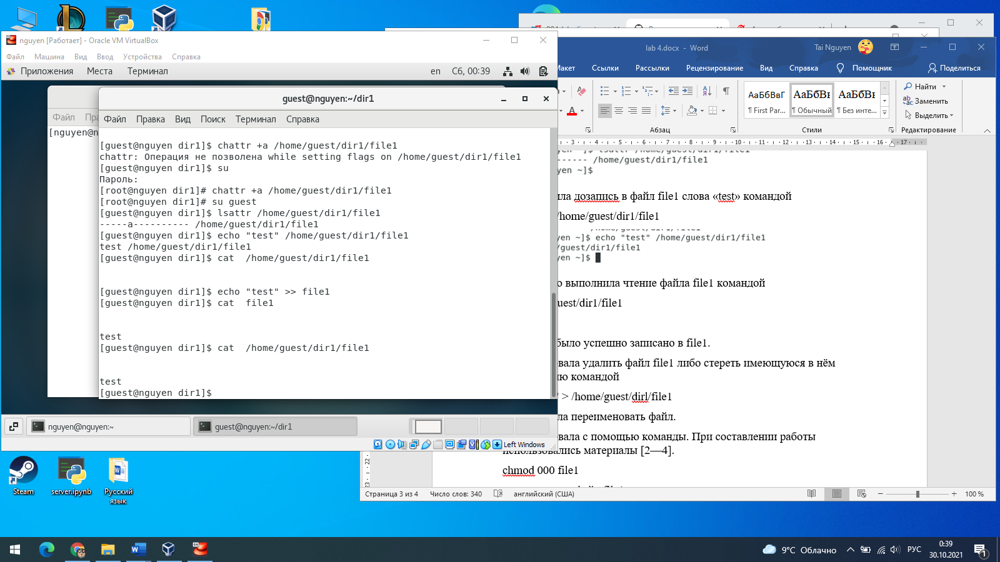

Слово test было успешно записано в file1.

\7. Попробовала удалить файл file1 либо стереть имеющуюся в нём информацию командой

echo "abcd" > /home/guest/dirl/file1

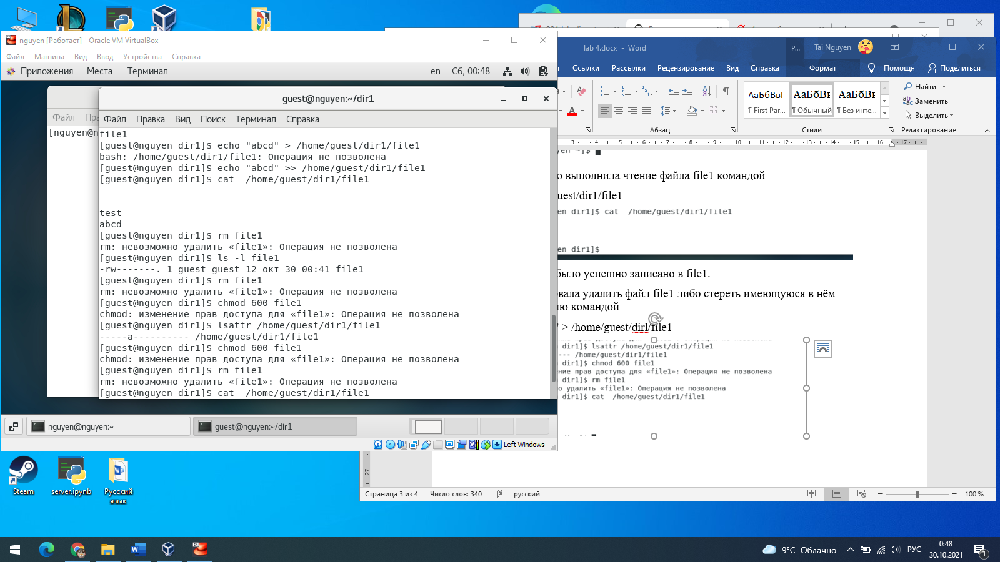

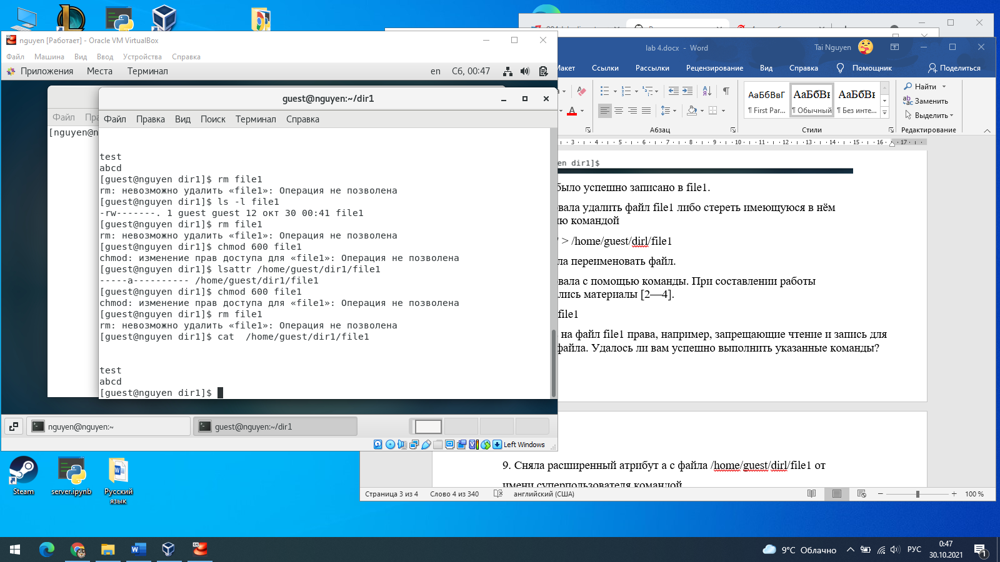

Попробовала переименовать файл.

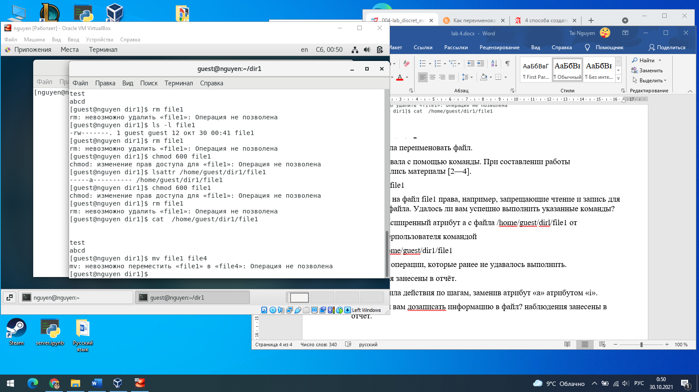

\8. Попробовала с помощью команды. При составлении работы использовались материалы [2—4].

chmod 000 file1

установить на файл file1 права, например, запрещающие чтение и запись для владельца файла. Не удалось выполнить указанные команды

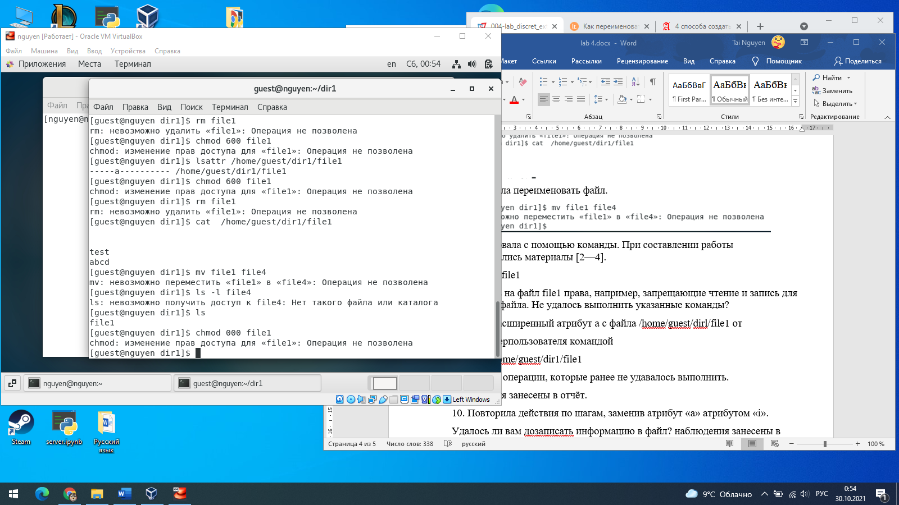

\9. Сняла расширенный атрибут a с файла /home/guest/dirl/file1 от

имени суперпользователя командой

chattr -a /home/guest/dir1/file1

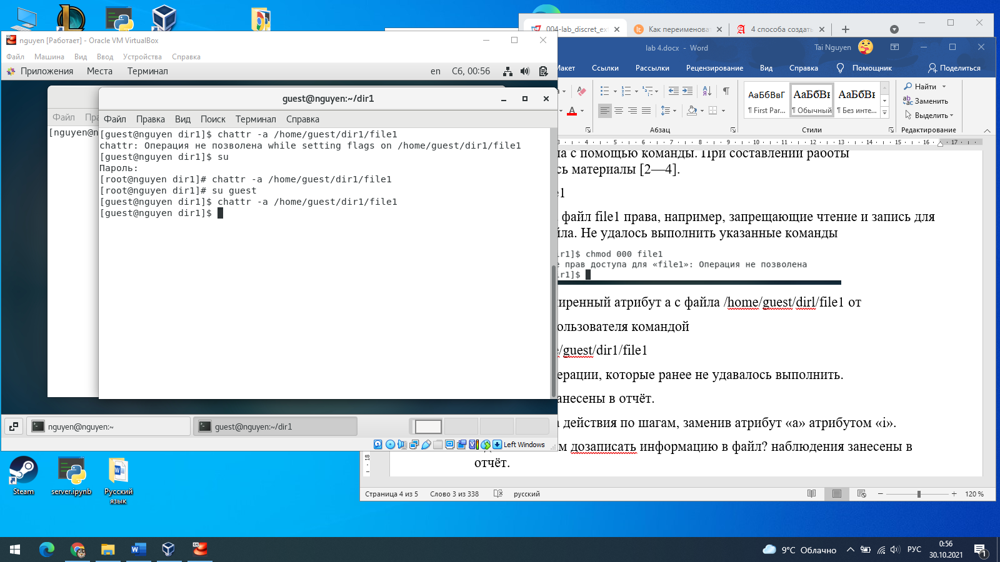

Повторила операции, которые ранее не удавалось выполнить.

наблюдения занесены в отчёт. Атрибут +а запрещала выполнить команды.

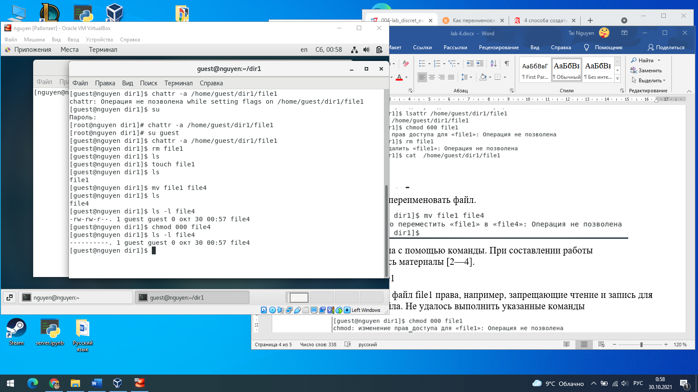

\10. Повторила действия по шагам, заменив атрибут «a» атрибутом «i».

Удалось ли вам дозаписать информацию в файл? наблюдения занесены в отчёт.

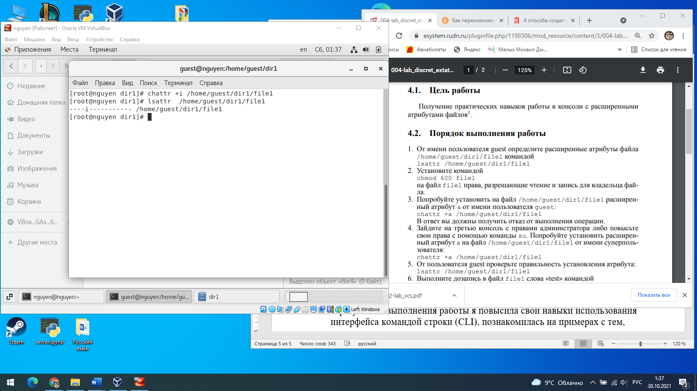

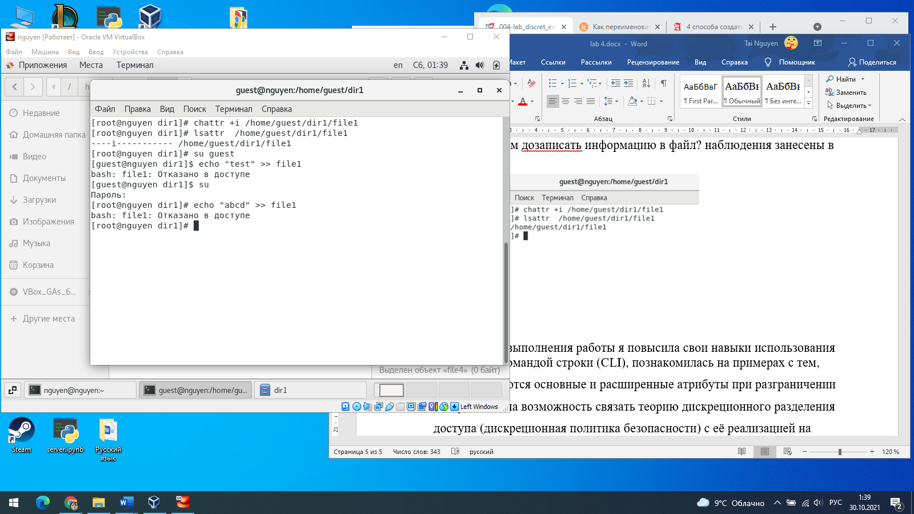

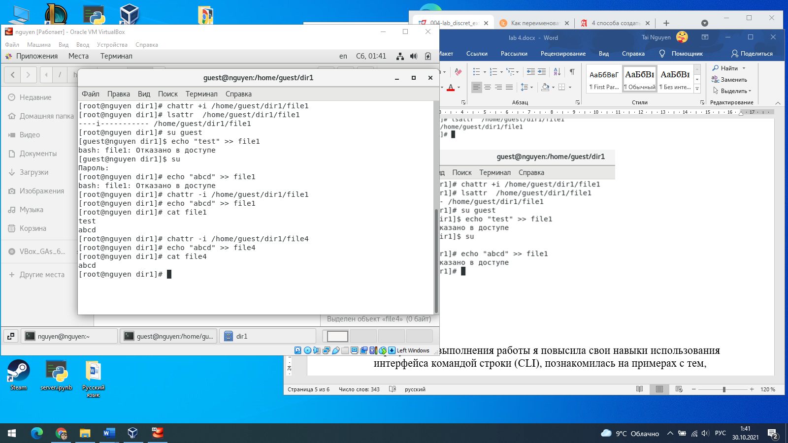

# **Вывод**

В результате выполнения работы я повысила свои навыки использования интерфейса командой строки (CLI), познакомилась на примерах с тем,

как используются основные и расширенные атрибуты при разграничении

доступа. Имела возможность связать теорию дискреционного разделения

доступа (дискреционная политика безопасности) с её реализацией на практике в ОС Linux. Составила наглядные таблицы, поясняющие какие операции возможны при тех или иных установленных правах. Опробовала действие на практике расширенных атрибутов «а» и «i».

